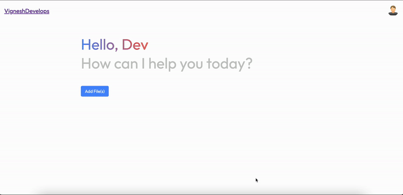

**Project: chat-with-docs**

Chat with Your Docs

## Demo

In this demo, a PDF file from the `demo` folder is uploaded, and questions are asked about the content of the PDF. The chatbot provides answers to the questions based on the PDF content.

_Welcome to chat-with-docs!_

This project empowers users to have interactive, conversational interactions with **multiple documents** at once, leveraging the capabilities of GPT and LangChain.

## Table of Contents

- [Features](#features)
- [Technologies](#technologies)
- [Setup and Installation](#setup-and-installation)
  - [Prerequisites](#prerequisites)
  - [Frontend](#frontend)
  - [API (Backend)](#api-backend)
- [Usage](#usage)
- [Demo](#demo)

## Features

- **Document Conversations**: Chat with multiple documents simultaneously for a comprehensive understanding of your content.
- **AI-Powered Chat**: Leverages GPT for sophisticated natural language processing and conversational AI.
- **LangChain Integration**: Enhances interactions with your documents by providing context and continuity in conversations.
- **Supports Multiple File Formats**: Upload and chat with documents in PDF, DOCX, and TXT formats.
- **Streaming Support**: Engage in real-time conversations with streaming responses for a more interactive chat experience.
- **Chat History**: Maintains chat history for each conversation, allowing you to refer back to previous interactions and continue where you left off.
- **Vector Database**: Utilizes Pinecone for efficient indexing and retrieval of document information.
- **FastAPI Backend**: Fast and reliable server-side API with seamless performance.
- **React Frontend**: Modern, responsive, and user-friendly interface for interacting with your documents.

## Technologies

- **Python**: Used for building the backend of the application.
- **FastAPI**: The web framework used for the backend API, offering high performance and asynchronous capabilities.
- **LangChain**: Integrates large language models (LLMs) and vector databases for contextual conversational experiences.
- **React**: Powers the modern and interactive frontend user interface.
- **Pinecone**: Utilized as the vector database for efficient indexing and retrieval of document information.
- **Ada Embedding Model**: Used for embedding documents into vector space for efficient retrieval and contextual conversations.
- **GPT LLM**: Provides powerful language understanding and generation capabilities for the chatbot.

## Setup and Installation

### Prerequisites

- **OpenAI API Key**: You will need to create an API key in [OpenAI](https://platform.openai.com/signup) to access GPT and Ada embedding models. Create a `.env` file in the `server/` directory and add the API key as `OPENAI_API_KEY` (refer to the provided `.env.example` file).

- **Pinecone API Key and Index**: This project uses Pinecone as the vector database. Register [here](https://app.pinecone.io/) and create an index. Add the API key and index to the `.env` file in the `server/` directory as `PINECONE_API_KEY` and `PINECONE_INDEX`.

### Frontend

To set up the frontend of the project, follow the instructions provided in [client/README.md](client/README.md).

### API (Backend)

For the API (backend), refer to the instructions outlined in [server/README.md](server/README.md).

## Usage

Once you've set up the project, use it as follows:

- **Start the Backend Server**: Run the FastAPI server to initialize the backend.
- **Launch the Frontend**: Start the React development server to use the application.
- **Upload and Chat**: Upload your documents in PDF, DOCX, or TXT format and start conversing with them naturally and intuitively. Enjoy real-time streaming responses for an enhanced chat experience.
